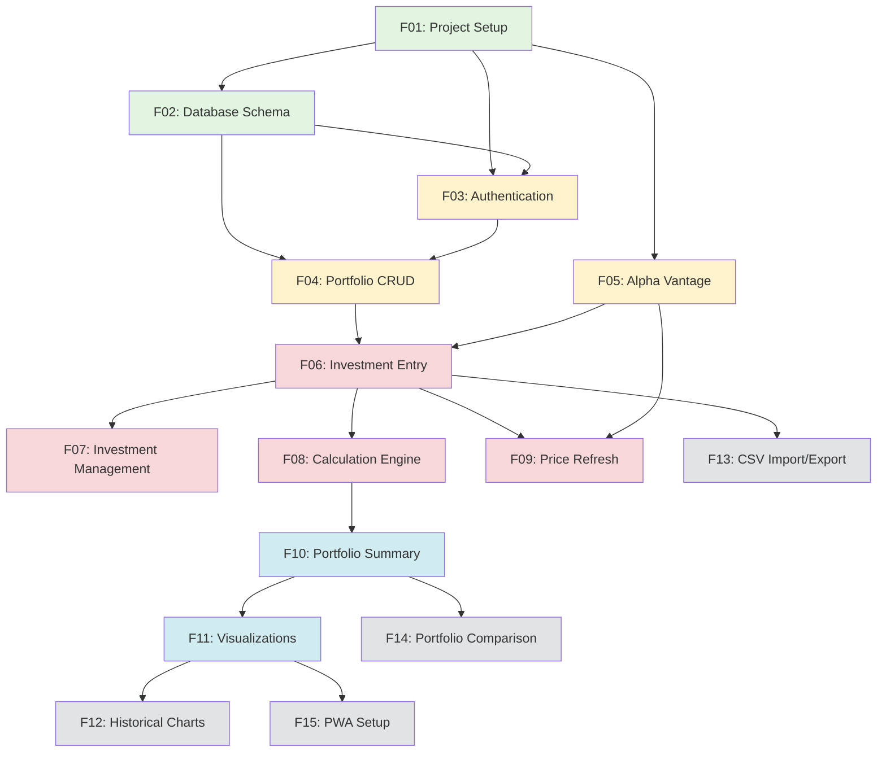

# Track Your Stack - Master Implementation Plan

**Status:** 🚀 Ready to Start
**Last Updated:** 2025-10-08
**Total Features:** 15 (11 MVP + 4 Phase 2)
**Estimated Timeline:** 6-8 weeks

---

## 📊 Progress Overview

| Phase | Features | Status | Progress |
|-------|----------|--------|----------|
| **Phase 1: MVP** | 11 features | Not Started | 0/11 (0%) |
| **Phase 2: Advanced** | 4 features | Not Started | 0/4 (0%) |
| **Total** | 15 features | Not Started | 0/15 (0%) |

---

## 🎯 MVP Feature List (Phase 1)

| ID | Feature | Dependencies | Estimated Time | Status |
|----|---------|--------------|----------------|--------|
| [F01](features/F01_project_setup.md) | Project Setup & Configuration | None | 1-2 days | ⬜ Not Started |
| [F02](features/F02_database_schema.md) | Database Schema & Prisma | F01 | 1 day | ⬜ Not Started |
| [F03](features/F03_authentication.md) | Authentication (Google OAuth) | F01, F02 | 2 days | ⬜ Not Started |
| [F04](features/F04_portfolio_crud.md) | Portfolio Management (CRUD) | F02, F03 | 2-3 days | ⬜ Not Started |
| [F05](features/F05_alpha_vantage_integration.md) | Alpha Vantage API Integration | F01 | 2 days | ⬜ Not Started |
| [F06](features/F06_investment_entry.md) | Investment Entry Form | F04, F05 | 2-3 days | ⬜ Not Started |
| [F07](features/F07_investment_management.md) | Investment Management (Edit/Delete) | F06 | 2 days | ⬜ Not Started |
| [F08](features/F08_calculation_engine.md) | Calculation Engine | F06 | 2 days | ⬜ Not Started |
| [F09](features/F09_price_refresh.md) | Price Refresh & Caching | F05, F06 | 2 days | ⬜ Not Started |
| [F10](features/F10_portfolio_summary.md) | Portfolio Summary & Metrics | F08 | 1-2 days | ⬜ Not Started |
| [F11](features/F11_visualizations.md) | Charts & Visualizations | F10 | 2-3 days | ⬜ Not Started |

**MVP Total Estimated Time:** 4-5 weeks

---

## 🚀 Phase 2 Feature List (Advanced)

| ID | Feature | Dependencies | Estimated Time | Status |
|----|---------|--------------|----------------|--------|
| [F12](features/phase2/F12_historical_charts.md) | Historical Performance Charts | F11 | 3-4 days | ⬜ Not Started |
| [F13](features/phase2/F13_csv_import_export.md) | CSV Import/Export | F06 | 2-3 days | ⬜ Not Started |
| [F14](features/phase2/F14_portfolio_comparison.md) | Portfolio Comparison | F10 | 2 days | ⬜ Not Started |
| [F15](features/phase2/F15_pwa_setup.md) | Progressive Web App | F11 | 2-3 days | ⬜ Not Started |

**Phase 2 Total Estimated Time:** 2-3 weeks

---

## 📈 Dependency Graph



**Legend:**
- 🟢 Green: Foundation (F01-F02)
- 🟡 Yellow: Core Features (F03-F05)
- 🔴 Red: Investment Features (F06-F09)
- 🔵 Blue: Visualization (F10-F11)
- ⚪ Gray: Phase 2 (F12-F15)

---

## 🔄 Recommended Implementation Order

### Week 1: Foundation
1. **F01** - Project Setup (Day 1-2)
2. **F02** - Database Schema (Day 3)
3. **F03** - Authentication (Day 4-5)

**Milestone:** Working authentication, empty dashboard

---

### Week 2: Core Infrastructure
4. **F04** - Portfolio CRUD (Day 6-8)
5. **F05** - Alpha Vantage Integration (Day 9-10)

**Milestone:** Users can create portfolios, API integration working

---

### Week 3: Investment Management
6. **F06** - Investment Entry (Day 11-13)
7. **F07** - Investment Management (Day 14-15)

**Milestone:** Users can add and manage investments

---

### Week 4: Business Logic
8. **F08** - Calculation Engine (Day 16-17)
9. **F09** - Price Refresh (Day 18-19)

**Milestone:** Accurate calculations and live price updates

---

### Week 5: Visualization
10. **F10** - Portfolio Summary (Day 20-21)
11. **F11** - Visualizations (Day 22-24)

**Milestone:** MVP complete with full visualization

---

### Week 6-8: Phase 2 (Optional)
12. **F12** - Historical Charts (Week 6)
13. **F13** - CSV Import/Export (Week 6-7)
14. **F14** - Portfolio Comparison (Week 7)
15. **F15** - PWA Setup (Week 8)

**Milestone:** Production-ready with advanced features

---

## 🎯 Git Workflow for Each Feature

### 1. Start Feature
```bash
git checkout main
git pull origin main
git checkout -b feature/<feature-name>

# Examples:
git checkout -b feature/authentication
git checkout -b feature/portfolio-crud
```

### 2. Implement & Commit
```bash
# Make changes, commit frequently
git add .
git commit -m "feat(<scope>): implement <feature>

- Detail 1
- Detail 2
- Update documentation"
```

### 3. Test & Push
```bash
# Run all checks
pnpm lint
pnpm typecheck
pnpm test
pnpm build

# Push and create PR
git push origin feature/<feature-name>
gh pr create --title "feat: <feature-name>" --body "..."
```

### 4. After PR Approval
```bash
# Merge via GitHub interface
# Delete local branch
git checkout main
git pull origin main
git branch -d feature/<feature-name>
```

---

## ✅ Definition of Done (Per Feature)

Each feature is considered complete when:

- [ ] All implementation steps from feature file completed
- [ ] All acceptance criteria met
- [ ] Unit tests written and passing
- [ ] Integration tests passing (if applicable)
- [ ] E2E tests passing (if applicable)
- [ ] No TypeScript errors
- [ ] No ESLint warnings
- [ ] Code formatted with Prettier
- [ ] Documentation updated (user guide + API docs)
- [ ] Screenshots captured (if UI changes)
- [ ] Changelog.md updated
- [ ] PR created and approved
- [ ] Feature deployed and verified in development
- [ ] This MASTER_PLAN.md status updated

---

## 📝 Progress Tracking

As you complete features, update this section:

### Completed Features
- None yet

### In Progress
- None

### Blocked
- None

### Notes & Decisions
- None yet

---

## 🔗 Quick Links

### Documentation
- [Full Specification](investment-tracker-specification.md)
- [Original Implementation Plan](implementation-plan.md)
- [User Documentation](../docs/user-guide/)
- [API Documentation](../docs/api/)
- [Architecture Docs](../docs/architecture/)

### Development
- [CLAUDE.md](../CLAUDE.md) - Development guidelines
- [README.md](../README.md) - Project overview
- [Changelog](../docs/changelog.md) - Change history

### External Resources
- [Next.js Documentation](https://nextjs.org/docs)
- [Prisma Documentation](https://www.prisma.io/docs)
- [NextAuth.js Documentation](https://next-auth.js.org/)
- [Alpha Vantage API](https://www.alphavantage.co/documentation/)
- [shadcn/ui Components](https://ui.shadcn.com/)

---

## 🎓 Learning Resources

If you're new to any of the technologies:

- **Next.js 15 App Router:** [Official Tutorial](https://nextjs.org/learn)
- **Server Actions:** [Next.js Server Actions Guide](https://nextjs.org/docs/app/building-your-application/data-fetching/server-actions-and-mutations)
- **Prisma ORM:** [Prisma Quickstart](https://www.prisma.io/docs/getting-started/quickstart)
- **NextAuth.js v5:** [NextAuth.js Getting Started](https://authjs.dev/getting-started)
- **TypeScript:** [TypeScript Handbook](https://www.typescriptlang.org/docs/handbook/intro.html)

---

## 💡 Tips for Success

1. **Read the feature file completely** before starting
2. **Check dependencies** - ensure required features are complete
3. **Create feature branch** before any code changes
4. **Commit frequently** with descriptive messages
5. **Test thoroughly** before creating PR
6. **Update documentation** as you build, not after
7. **Capture screenshots** immediately after UI implementation
8. **Ask questions** if anything is unclear
9. **Review CLAUDE.md** for code patterns and guidelines
10. **Keep the main branch stable** - never commit directly

---

## 🆘 Need Help?

- Review feature dependencies in the graph above
- Check [CLAUDE.md](../CLAUDE.md) for code patterns
- Read [investment-tracker-specification.md](investment-tracker-specification.md) for detailed specs
- Consult official documentation for technologies used

---

**Next Step:** Start with [F01: Project Setup](features/F01_project_setup.md) 🚀
